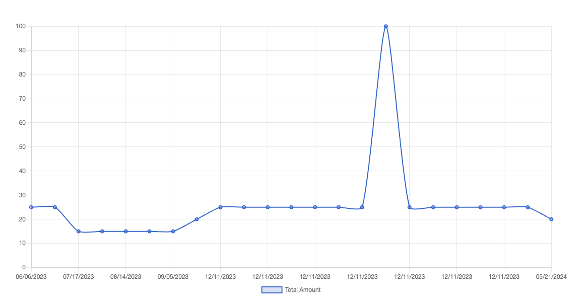
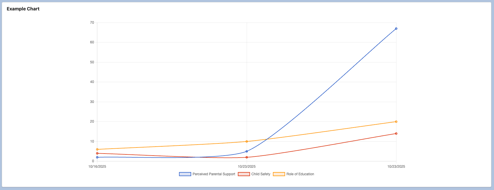
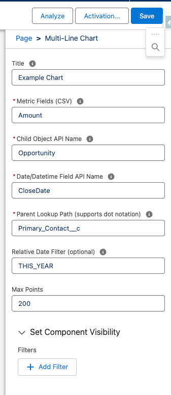

# MultiLineChart
An admin configurable multi-line graph to drop in on any Lightning record page, that works with multiple relationship layers dynamically.

# 🚀 Quick Install

# Key Features
1. Works on any Lightning record page
2. Works on any Object (standard or custom)
3. Works with any relationships upto current record with dot notation
4. Renders with automatically contrasting line graph colors, styles, and dot shapes.

# How it works 
- Drop the component "Multi-Line Graph" onto a Lightning record page
- Fill in the fields to configure the component for your use case:
    - Title: the title that will show above the line graph.
    - Metric Fields (CSV): comma-separated list of field API names on the target reporting object that will each render as a separate line (series).
    - Child Object API Name: the reporting object that generates the lines (series). Also the object that the Metric Fields exist on.
    - Date/Datetime Field API Name: a date or datetime field used to generate the X-axis to generate the graph over time.
    - Parent Lookup Path: the pathway to get from target records to the "current" record based on the rendered Lightning page. This can be one lookup (e.g. Opportunity__c), or dot notation (e.g. Student__c.Account.OwnerId) using __c, not __r, for relationships.
    - Relative Date Filter: Optionally enter 1 Salesforce literal date filter value (e.g. THIS_YEAR, or LAST_N_DAYS:20) to filter the retrieved records.
    - Max Points: if you want to, set a max limit of # of points to allow it to render. Defaults to 200. 
- When it loads, it queries the child records based on the parameters entered and renders them in a line graph in real-time, generating multiple lines based on each field in teh "Metric Fields" field.

# Dependencies 
- For this to work, you must have a minified ChartJS uploaded as a static resource with the name set to exactly 'chartjs'. At time of creation, I recommend 3.9.1 which is included in this repo...
- But as time has a tendency to keep moving forward, if you want a newer version you can get it here: https://cdnjs.com/libraries/Chart.js

# Images 
*Single Line Example:* 

*Multi Line Example:* 

*Component in the App Builder:* 

# Support, Questions, or Feedback?
- Get in touch on my website: https://tylerclass.notion.site/contact
